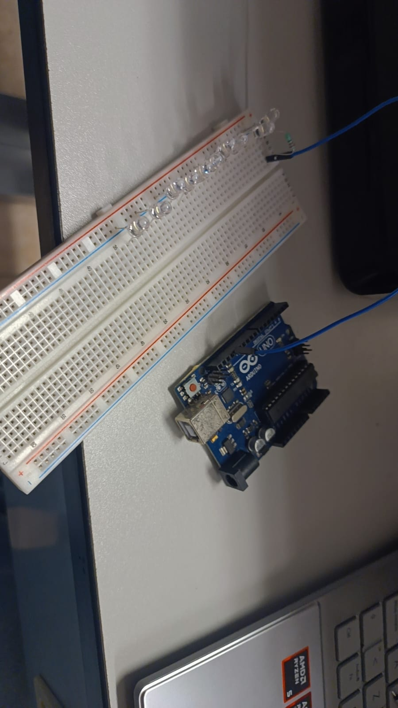

Nombre del proyecto
10 led

Descripción
el objetivo de este codigo expone como prender y apagar un led

Objetivos de aprendizaje
Programar y simular en Arduino el encendido y apagado intermitente (parpadeo) de un LED conectado al pin digital 13, utilizando la función delay() para generar un efecto visualmente perceptible.

Material utilizado
Enumera todos los componentes usados:

Arduino Uno
Protoboar
10 led
Cables macho macho
Resistencia 220 ohms
Diagrama del circuito

Código
[Readme.txt](codigo/Readme.txt))
Video del funcionamiento
Readme

[Ver video en YouTube]https://youtube.com/shorts/GOXbr2vivvE?si=4X2x-ovMDbM5Vy9E

Evidencias de armado

Reporte
[arduinopdf.pdf](Reporte/arduinopdf.pdf)

Gráficas (insertar imagen o link)
Tablas de datos
Observaciones sobre el comportamiento del sistema
Conclusiones
los 10 led prenden con el codigo C++
Resultados
Resultados.pdf

Este documento contiene la descripción de la práctica, objetivos y procedimientos realizados.

