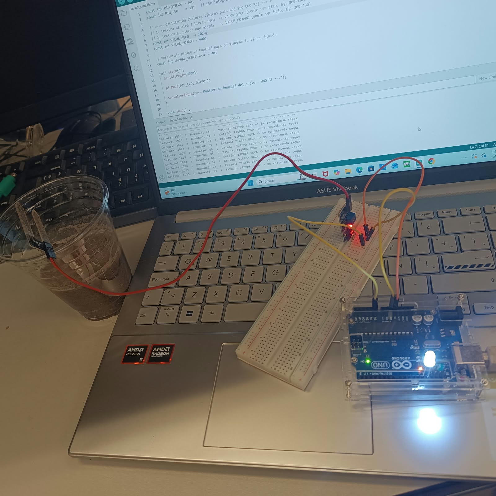

## Nombre del proyecto
HUMEDAD

## Descripción
el objetivo es que el carro funcione con luz solar

## Objetivos de aprendizaje
Que el carro avance con luz solar
## Material utilizado
Arduino R3

cables

led

proto

sensor de humedad en tierra

Código
[Readme.txt](codigo/Readme.txt))

Video del funcionamiento
Readme

[Ver video en YouTube](https://youtube.com/shorts/H6F9e3RdiFM?si=GComa02lk6osWoHU))

Evidencias de armado

resultados
[Reporte_Carrito_Solar.pdf](resultados/Reporte_Carrito_Solar.pdf)

Gráficas (insertar imagen o link)
Tablas de datos
Observaciones sobre el comportamiento del sistema
Conclusiones
la automatizacion funciona
Resultados
Resultados.pdf

](https://youtube.com/shorts/H6F9e3RdiFM?si=GComa02lk6osWoHU)

